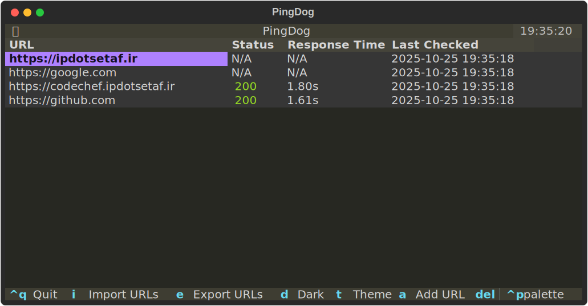

# PingDog
<pre>
     _/\/\/\/\/\____/\/\________________________________/\/\/\/\/\___________________________
    _/\/\____/\/\__________/\/\/\/\______/\/\/\/\______/\/\____/\/\____/\/\/\______/\/\/\/\_ 
   _/\/\/\/\/\____/\/\____/\/\__/\/\__/\/\__/\/\______/\/\____/\/\__/\/\__/\/\__/\/\__/\/\_  
  _/\/\__________/\/\____/\/\__/\/\____/\/\/\/\______/\/\____/\/\__/\/\__/\/\____/\/\/\/\_   
 _/\/\__________/\/\/\__/\/\__/\/\________/\/\______/\/\/\/\/\______/\/\/\__________/\/\_    
___________________________________/\/\/\/\__________________________________/\/\/\/\___     
</pre>

PingDog is an application for monitoring HTTP services and website availability that runs in your console! It provides real-time status monitoring with a clean, interactive interface.

## Features

- Real-time monitoring of multiple URLs
- Response time tracking
- HTTP status code visualization
- Interactive TUI with keyboard shortcuts
- URL management (add, delete, import, export)
- Configurable check intervals
- Theme support

## Screenshot

<p align="center">
    
</p>

## Installation

1. Install required dependencies:
    ```
    pip install -r requirements.txt
    ```

## Usage

### Command Line Arguments

    python PingDog.py [-h] [-f FILE] [-i INTERVAL] [urls ...]

- `-f, --file`: Path to file containing URLs (one per line)
- `-i, --interval`: Check interval in seconds (default: 5)
- `urls`: Space-separated list of URLs to monitor (alternative to using a file)
- `-h, --help`: Show help message

### Keyboard Shortcuts

- `Ctrl+Q`: Quit application
- `i`: Import URLs from file
- `e`: Export URLs to file
- `d`: Toggle dark mode
- `t`: Change theme
- `a`: Add new URL
- `Delete`: Remove selected URL

### URL File Format

Create a text file with one URL per line:
```
https://example.com
https://api.example.com
https://service.example.com
```

### Examples

Monitor URLs from a file:
```
python PingDog.py -f urls.txt
```

Monitor specific URLs with custom interval:
```
python PingDog.py -i 10 https://example.com https://api.example.com
```

## Contribution
- You can open Issues for any bug report or feature request.
- You are free to contribute to this project by following these steps:
   1. Fork this Repo.
   2. Create a new branch for your feature/bugfix in your forked Repo.
   3. Commit your changes to the new branch you just made.
   4. Create a pull request from your branch into the `main` branch of This Repo([https://github.com/IPdotSetAF/PingDog](https://github.com/IPdotSetAF/PingDog)).
